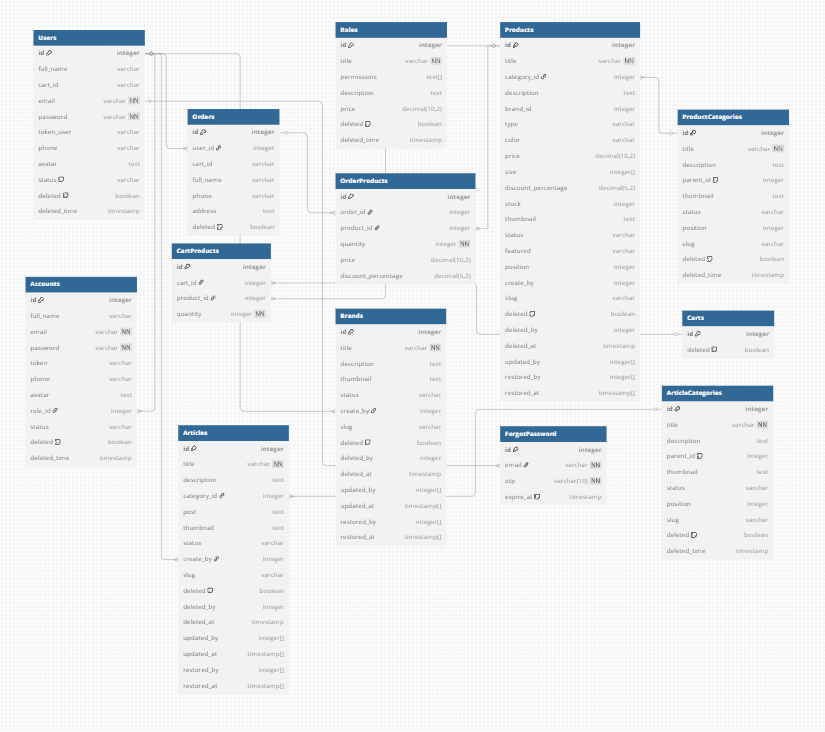

# Products Management System

## Giới thiệu

 Products Management System là một ứng dụng web dùng để quản lý thông tin sản phẩm, danh mục và bài viết.  Dự án áp dụng phương pháp Server-side Rendering (SSR) và gồm hai phần chính: 
 Admin: Quản trị viên có thể thêm, chỉnh sửa, xóa sản phẩm, danh mục, bài viết và quản lý quyền người dùng. 
 Client: Khách hàng có thể tìm kiếm, đặt hàng, yêu cầu đặt lại mật khẩu, xác thực và đăng ký tài khoản.

## Chức năng chính
Quản lý sản phẩm, danh mục, bài viết 
Phân quyền người dùng 
Lọc và tìm kiếm đơn hàng 
Đặt hàng và quản lý đơn hàng 
Xác thực và đăng ký tài khoản 
Yêu cầu đặt lại mật khẩu

## Cài đặt và sử dụng
Yêu cầu hệ thống 
Node.js v16+ 
MongoDB Atlas hoặc cấu hình cơ sở dữ liệu MongoDB cụ thể

## Cách chạy dự án
git clone https://github.com/ThanhBQ1415/Products-Management-System.git 
cd Products-Management-System

## Cài đặt dependencies
npm install

## Cấu hình biến môi trường
Tạo file .env và thêm thông tin cần thiết: 
MONGO_URI=your_mongodb_connection_string 
PORT=5000 
JWT_SECRET=your_jwt_secret

## Database

## Chạy server
npm start 
Truy cập trang web 
Mở trình duyệt và truy cập: http://localhost:3000

## Công nghệ sử dụng
Backend: Node.js, Express, MongoDB 
Frontend: React, Next.js (nếu dự án dùng SSR) 
Xác thực: JSON Web Token (JWT) 
Triển khai: Vercel 

